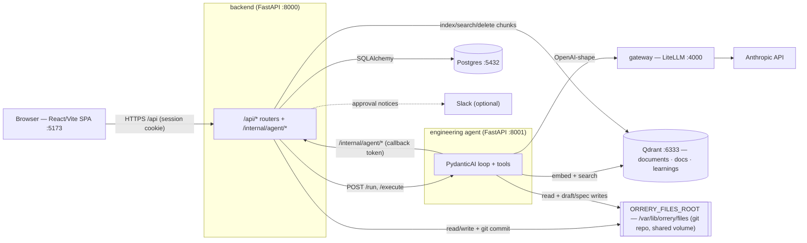
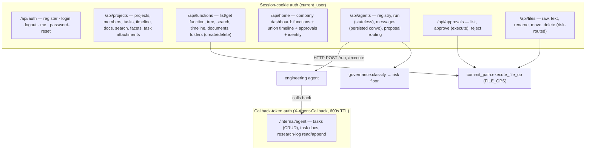
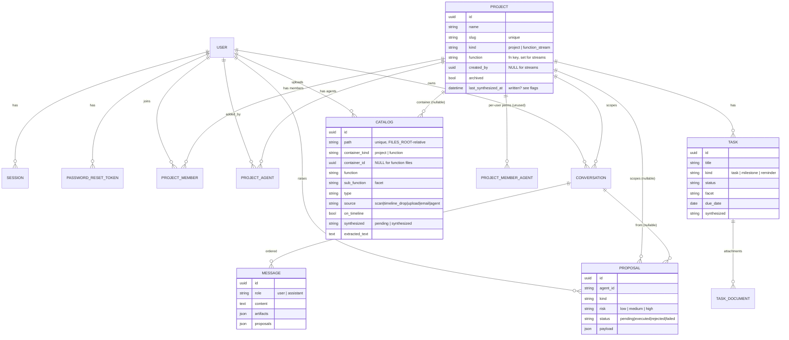
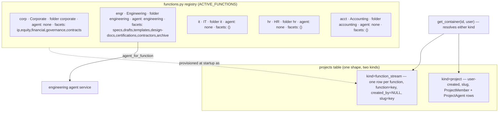
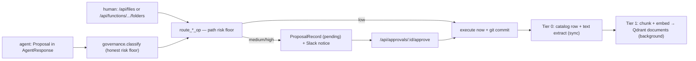
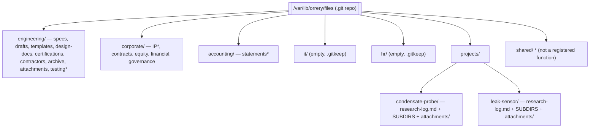
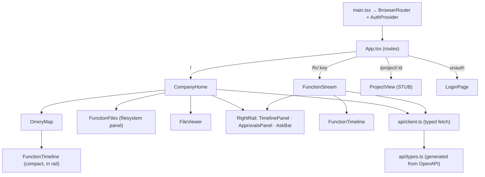

# Orrery — Current Architecture (as-built)

_Generated 2026-06-22 from a read of the actual code. Describes what exists today, not the long-term design. Inconsistencies and half-built seams are flagged in the last section._

## Overview

Orrery is a monorepo "company operating system": a **React frontend** → **FastAPI backend** (the only thing that talks to anything privileged) → a **stateless PydanticAI engineering agent** that reaches Claude through a **LiteLLM gateway**, with **Postgres** for relational state, **Qdrant** for vector search, and a **git-versioned file store** (`ORRERY_FILES_ROOT`) shared between the backend and the agent.

The core domain idea: a **Function** (Corporate, Engineering, IT, HR, Accounting) is a first-class *container* that owns a folder, a timeline, files, and facets — independent of whether an **Agent** occupies it. Functions and **Projects** are both stored as rows in one `projects` table, discriminated by a `kind` column. Today only Engineering has a live agent ("Forge", registry id `engineering`).

---

## 1. System topology / deployment

**Docker services** (`docker-compose.yml`): `gateway` (LiteLLM), `qdrant`, `engineering` (agent HTTP :8001), `postgres:16`, `backend` (:8000), and an `agent` CLI profile (same image as `engineering`). The frontend dev server (Vite :5173) runs outside compose and proxies `/api` to the backend. `backend` and `engineering` both bind-mount `/var/lib/orrery/files` read-write; Qdrant and Postgres use named volumes.

---

## 2. Backend route families

| Router | Owns |
|---|---|
| `auth.py` | Email/password identity, Argon2 hashes, server-side sessions (sliding 14-day), password reset (token emailed — see flags). |
| `projects.py` | Project lifecycle + membership; the shared `get_container()` (resolves project membership OR function access); tasks (action items/reminders/milestones); the unified `build_timeline`; per-container search; document drop; task↔document attachments. |
| `functions_api.py` | Function-as-container ops: tree, search, timeline, document drop (with `dir`), and **folder create/recursive-delete** (risk-routed); plus `/api/home`. |
| `agents.py` | Agent registry (only `engineering`), stateless `/run`, persisted conversations (`messages`), and **proposal routing** (classify → low auto-executes, medium/high queue). |
| `approvals.py` | The human approval queue. On approve: `FILE_OPS` execute locally via `commit_path`; agent proposals delegate to the agent's `/execute`. |
| `files.py` | Read (`raw`/`text`) + human file mutations (rename/move/delete), all risk-routed by destination path. |
| `internal.py` | The agent's callback surface (tasks, task-doc links, research-log) — guarded by a short-lived signed callback token + an "agent engaged on this container" check. |

---

## 3. Data model

Tables: `users`, `sessions`, `password_reset_tokens`, `projects`, `project_members`, `project_agents`, `project_member_agents`, `tasks`, `task_documents`, `conversations`, `messages`, `proposals`, `catalog`. All child rows cascade-delete from their parents. **`catalog`** is the universal file index — `container_id` is NULL for function-folder files (scoped instead by `container_kind="function"` + `function`).

---

## 4. Container model — Function · Agent · Project

A **function stream** is just a `projects` row with `kind="function_stream"`, `created_by=NULL`, and `function` = the registry key; it has no `ProjectMember` rows (access is by function-level permission, currently "any authenticated user"). A **project** is user-created with explicit members and one or more attached agents. The same endpoints serve both via `get_container()`. An agent attaches to a function purely through the registry's `agent_id`; standing up a second agent later is "fill in `agent_id` + register the service," no schema change.

**Governed mutation flow** (shared by humans and the agent):

Sensitive destinations (`corporate/equity/`, `corporate/financial/debt/`) and `save_spec` force at least medium risk, queueing for approval regardless of what the caller claims.

---

## 5. Engineering agent + web↔agent round trip

The agent (`agents/engineering`, FastAPI :8001) exposes `GET /health`, `POST /run` (`AgentRequest → AgentResponse`), and `POST /execute` (bounded write after approval). It's a **PydanticAI** loop whose model is built by `orrery_lib.gateway` against the LiteLLM gateway. Behavior lives in `config/engineering/agent.md` (loaded at startup).

**Tools** (`agents/engineering/.../agent.py` + `orrery_lib/pm.py`):
- Read-only: `search_files`, `read_file`, `search_docs` (Qdrant `documents`), `search_kb` (Qdrant `learnings`), `add_kb` (proposal-queue only), `web_search` (Exa).
- Proposal-only writes: `request_spec_save` (stages a URL; no I/O) and draft creation (separate module). The agent never writes the file store directly during reasoning.
- Project-scoped (only when a `callback` is present): `list/create/update task`, `link_task_to_doc`, `read/append research-log` — all HTTP calls back into `/internal/agent/*`.

**Round trip:** Frontend `POST /api/agents/engineering/messages` → backend builds `AgentRequest` (history + `project_context` + a signed `AgentCallback` when project-scoped) → `POST http://engineering:8001/run` → agent runs, optionally calling back into `/internal/agent/*` with the token → returns `AgentResponse{text, artifacts, proposals}` → backend classifies/routes proposals and persists the conversation. `orrery_lib` also holds the shared `schema` (AgentRequest/Response, Proposal, Artifact), `kb`, `docstore` (the `documents` collection, 1:1 with files), and `filestore` (git-committed reads/writes). Embeddings: `BAAI/bge-small-en-v1.5` (384-dim), pinned in payloads.

---

## 6. FILES_ROOT layout (actual, on disk)

Function folders mirror the registry (`engr`→`engineering`, `acct`→`accounting`). Each project gets `research-log.md` + the cross-functional `SUBDIRS` (drafts, engineering, marketing, manufacturing, decisions) + an `attachments/` drop folder. Folders marked `*` are real on disk but **not** in the declared facet vocabulary (they exist because folders are now free-form). The whole tree is one git repo; every add/move/delete is a commit. `.gitkeep`, `.git`, `.DS_Store`, and `attachments/` are skipped by the scanner.

---

## 7. Frontend structure

The live UI is the warm-paper set under `src/app/orrery/` (`Shell`, `CompanyHome`, `OrreryMap`, `FunctionFiles`, `FileViewer`, `FunctionStream`, `FunctionTimeline`, `RightRail`, `ProjectView`, plus `theme/time/timelineScale`). `api/client.ts` is a thin typed fetch layer over `api/types.ts`, which is generated from the backend's OpenAPI (`npm run gen:types`). Routes: `/` = Company Home (orrery map + file panel + right rail), `/fn/:key` = Function page (250px timeline + composer + 25% approvals/ask sidebar), `/project/:id` = **stub**.

---

## 8. Flags — half-built, deferred, or inconsistent

**Stubs / not wired**
- **ProjectView** (`/project/:id`) is a placeholder — the route renders "a later increment." Project Views are linked to from the map/function rows but lead nowhere real yet.
- **Knowledge synthesis** (Tier 2): `Catalog.synthesized`, `Task.synthesized`, `Project.last_synthesized_at` are written (set to `pending` on edits) but **no pass ever reads them** — no synthesizer exists. `pending_synth_count` drives the Home "N pending" badges off data nothing consumes.
- **Email**: only a console sender exists; password-reset links are logged, not sent (Postmark deferred).
- **Google Drive**: `orrery_lib/drive.py` and `ORRERY_ENG_DRIVE_*` env vars exist but are unused (Phase-1 uses the local git store).
- **MFA**: `User.mfa_*` columns exist, never enforced.
- **Per-user agent permissions**: `project_member_agents` (`can_talk`/`can_approve`) table exists but is never checked — "any authenticated user may use engineering."

**Inconsistencies**
- **Company name**: frontend hardcodes `"PPI"` (CompanyHome/FunctionStream/ProjectView) while the backend `config.company_name` is `"Orrery"` and `/api/home` returns it — the UI ignores the backend value.
- **Facet vs folder case**: corp's facet is `ip` (lowercase) but the on-disk folder is `corporate/IP` (uppercase) — move-target validation is case-sensitive, so this folder isn't a valid facet target.
- **Stray on-disk dirs**: a top-level `shared/` exists but is **not** a registered function (orphan); `engineering/testing` and `accounting/statements` are real folders outside the declared facet lists (legitimate now that folders are free-form, but they won't appear as facet chips).
- **Sensitive-prefix mismatch**: the risk floor watches `corporate/financial/debt/`, but the on-disk folder is just `corporate/financial` (no `debt` subfolder) — the guard currently matches nothing real.
- **Project uploads** are always tagged `function="engr"` (`_PROJECT_FUNCTION` hardcoded); cross-functional per-file tagging is deferred.
- **Upload-path facets**: `commit_path.add_file` never sets `sub_function`; only `scan.py` derives facets from paths, so manually-uploaded files lack a facet until a rescan.

**Dead code / cleanup**
- The entire **old frontend** under `src/app/` is unreachable: `Workspace`, `Timeline`, `TimelinePlot`, `Tasks`, `TaskAttachments`, `FsExplorer`, `FilePreview`, `Projects`, `Messages`, `Approvals`, `SearchBox`, `constants`, and `fsEngine.ts` (~28 KB) — none imported by any live route.
- Backend `projectstore.save_upload` / `delete_upload` are defined but uncalled (superseded by `commit_path`).

**Rough edges (work, but worth noting)**
- Agent **artifacts** are modeled end-to-end but the agent never emits any (proposals are the real write surface).
- Deleting a conversation message doesn't clean up any proposals it spawned.
- Callback-token TTL (600s) and the risk-floor table are hardcoded (not config).
- The agent image is shared between the HTTP service and a CLI profile via compose entrypoint overrides — works, but implicit.
- `CLAUDE.md` describes an `infra/docker-compose.yml`; the real file is top-level `docker-compose.yml`.
